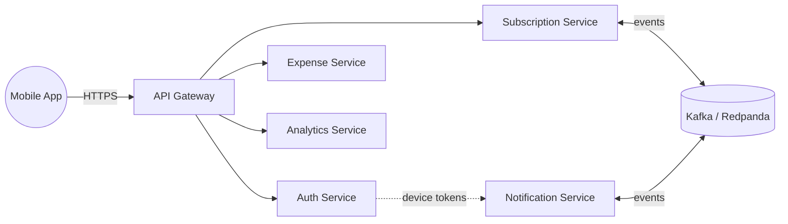
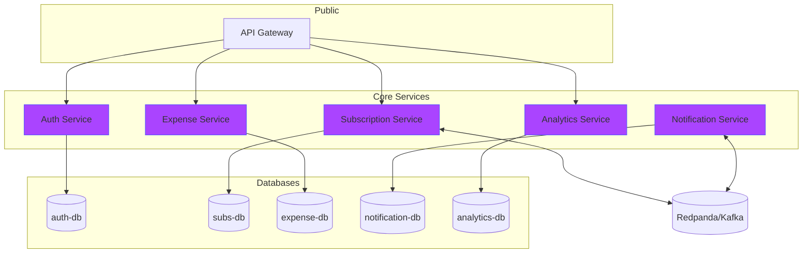

# Architecture Overview

## System Context

```mermaid
flowchart LR
    User((Mobile App)) --> |HTTPS| API[API Gateway]
    API --> AUTH[Auth Service]
    API --> SUBS[Subscription Service]
    API --> EXP[Expense Service]
    API --> AN[Analytics Service]
    SUBS <-->|events| BUS[(Kafka / Redpanda)]
    NOTIF[Notification Service] <-->|events| BUS
    AUTH -.->|device tokens| NOTIF
```

```mermaid
graph TB
  subgraph Public
    GW[API Gateway]
  end
  subgraph Core Services
    A[Auth Service]:::svc
    S[Subscription Service]:::svc
    E[Expense Service]:::svc
    N[Notification Service]:::svc
    L[Analytics Service]:::svc
  end
  subgraph Databases
    ADB[(auth-db)]
    SDB[(subs-db)]
    EDB[(expense-db)]
    NDB[(notification-db)]
    LDB[(analytics-db)]
  end
  BUS[(Redpanda/Kafka)]
  GW --> A & S & E & L
  A --> ADB
  S --> SDB
  E --> EDB
  N --> NDB
  L --> LDB
  S <--> BUS
  N <--> BUS
  classDef svc fill:#a4f,stroke:#55f,stroke-width:1px;
```
